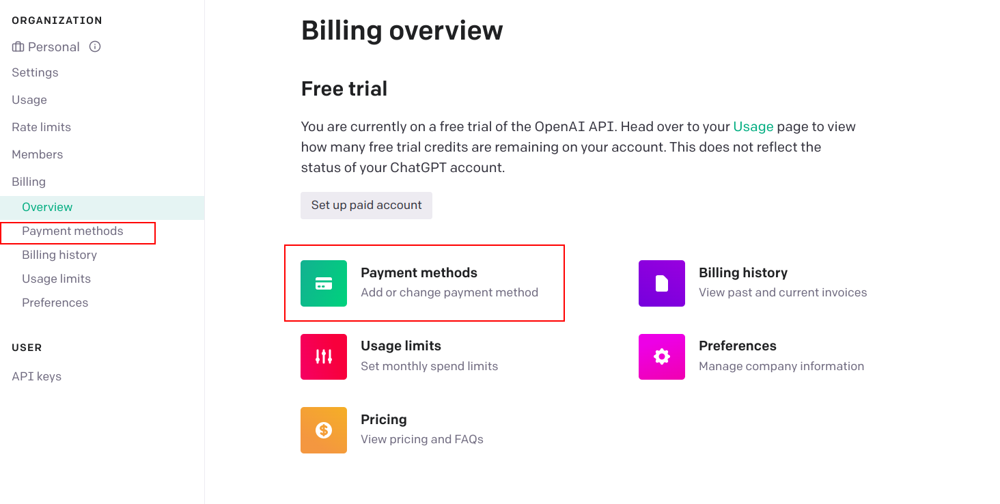

# Introduction

Integrating AI services into your projects has become increasingly important, and obtaining an OpenAI API key is a vital step in this process. By acquiring an API key, you unlock access to OpenAI's robust natural language processing capabilities, empowering you to optimize the efficiency and precision of your applications. In this comprehensive guide, we will walk you through the step-by-step process of obtaining an OpenAI API key. Tools like [Arakoo EdgeChains](https://github.com/arakoodev/edgechains) can greatly assist you in utilizing the OpenAI API seamlessly.

## Is an OpenAI API Key Free?

**Free Trial, Credit and Billing Information**

You can create an OpenAI API key free of charge. As a new user, you will receive $5 (USD) worth of credit as part of the free trial. However, please note that this credit expires after three months. Once your credit has been utilized or expired, you have the option to enter your billing information to continue using the API according to your requirements. It's important to remember that if you do not provide billing information, you will still have login access but won't be able to make additional API requests.

**Rate Limits:**

OpenAI implements rate limits at the organizational level, and if you are using their services for business purposes, payment may be required based on certain factors. Rate limits are measured in two ways: RPM (requests per minute) and TPM (tokens per minute).

**Cost and Pricing:**

If you are interested in specific costs associated with the AI model you intend to use (e.g., GPT-4 or gpt-3.5-turbo, as employed in ChatGPT), you can refer to [OpenAI's AI model pricing page](https://openai.com/pricing). In many cases, utilizing the API could be more cost-effective than a paid ChatGPT Plus subscription, although the actual expenses depend on your usage. 

> For a comprehensive overview of precise rate limits, examples, and other valuable details, we recommend visiting [OpenAI's Rate Limits page](https://platform.openai.com/docs/guides/rate-limits).

## How do I get an OpenAI API Key?
To begin with, follow the steps below.

### 1. Create an OpenAI account

To get started, please navigate to the [OpenAI platform website](https://openai.com/) and proceed with creating an account by following the provided instructions. You have the option to sign up using your preferred email address and password, or alternatively, you can utilize your existing Google or Microsoft account for a seamless registration process.

After completing the registration, OpenAI will send you a confirmation email to verify your account. Please locate the email in your inbox and click on the verification link provided to ensure the utmost security of your account. Once you have verified your account, return to the OpenAI website and click on the "Log In" button. 

### 4. Navigate to the API section

Upon logging in, you will locate your name and profile icon situated in the upper-right corner of the OpenAI platform homepage. Please click on your name to unveil a dropdown menu, and proceed to select the _View API keys_ option. Alternatively you can navigate to the [apps section](https://platform.openai.com/apps) and click on API. 

### 5. Generate a new API key
In the API keys section, please find the _Create new secret key_ button and proceed to click on it in order to generate a fresh API key. A dialog box will promptly appear, requesting you to provide a descriptive name for your secret API key. It is advisable to choose a name that conveys its purpose clearly, facilitating future identification. Ensure that you save the API key promptly, as the window displaying it cannot be reopened once closed.

### 7. Set up billing
OpenAI charges for API usage based on your usage volume. Therefore, if you haven't already set up a payment method for billing, it's necessary to do so before your newly created API key can function.

To initiate the billing setup process, navigate to the _Billing_ section located in the left-hand menu, followed by selecting the _Payment methods_ option. Within the payment methods interface, you will encounter an option labeled _Add payment method_. By clicking on this option, a pop-up window will emerge, facilitating the input of your credit card details and pertinent billing information. Once you have provided all the required information, please proceed by clicking _Submit_ to finalize the process.

### 8. Set usage limits
To ensure efficient management of your monthly API expenditure, it is advisable to establish usage limits after setting up the billing process.

To proceed, navigate to the left menu and select the option _Usage limits_. Here, you can define both hard and soft usage limits based on your specific requirements. Once you have determined the desired limits, simply click on the _Save_ button to save your changes.

By following these steps, you will successfully obtain an OpenAI API key and be ready to harness the power of OpenAI's natural language processing capabilities in your projects.

### Ensure you follow OpenAI's usage guidelines‍

As a final note, be sure to familiarize yourself with OpenAI's use case policy and terms of use.You can find detailed information regarding these policies at the [OpenAI usage policies](https://openai.com/policies/usage-policies) .

## API Key Best Practices

### Key Security

When it comes to securing your OpenAI API key, it is crucial to follow best practices to protect sensitive information. Here are some key security measures to consider:
1. **Secure Storage**: Store your API key in a secure location, such as a password-protected and encrypted storage system. Avoid storing it in plain text or easily accessible locations, such as code repositories.
2. **Restricted Access**: Limit access to your API key to authorized individuals only. Implement robust access controls and authentication mechanisms to ensure that only trusted parties can retrieve and use the key.
3. **Device Limitations**: Minimize the number of devices that store your API key. By reducing the number of endpoints where the key is stored, you can reduce the potential attack surface and enhance overall security.

### Key Rotation
Regularly rotating your API key is essential for maintaining its security. By frequently changing your key, you mitigate the risks associated with long-term exposure or compromise. Follow these guidelines for effective key rotation:
1. **Timely Updates**: Whenever you change your API key, make sure to promptly update it across all integrations and applications that rely on it. This ensures that any potential vulnerabilities associated with the previous key are eliminated.
2. **Automation Tools**: Consider leveraging automation tools specifically designed for managing and rotating multiple API keys. One such tool is [Arakoo EdgeChains](https://www.arakoo.ai/), which provides seamless key management capabilities to simplify the process.

## Integrating the OpenAI API

### Selecting the Appropriate API Endpoint
Depending on your use case, you may need to interact with different API endpoints provided by OpenAI, such as `Completion` or `Translation`. Ensure to review OpenAI's documentation to understand which endpoint best fits your needs.

### API Request and Response Handling
When integrating the OpenAI API, be sure to handle requests and responses properly. Construct the appropriate request headers and payloads based on OpenAI's documentation, and handle potential errors gracefully. Implement appropriate timeouts and error-handling mechanisms to maintain the stability of your application.

## Common Use Cases for the OpenAI API

### AI-Generated Content
The `Completion` endpoint enables the generation of human-like, context-relevant content for a variety of purposes, such as article drafting, email composition, and social media posting.

### Natural Language Translation
With OpenAI's `Translation` endpoint, you can easily translate text between various languages, assisting with communication in multilingual environments.

### Sentiment Analysis
By analyzing the emotion or tone of content, OpenAI can provide valuable insights for customer relationship management or market research.

### Text Summarization
The API can help in condensing long documents, articles, or emails into brief, coherent summaries, saving valuable time and improving readability.

### Question and Answer Systems
Leveraging OpenAI's natural language understanding, creating intelligent chatbots and automated customer support systems is simplified.

# Conclusion
Acquiring an OpenAI API key will unlock the potential of OpenAI's powerful language processing capabilities for your projects. Following best practices and carefully integrating the API into your projects will help you make the most of these powerful tools. Remember, tools like [Arakoo EdgeChains](https://github.com/arakoodev/edgechains) can assist you in the integration process, enabling seamless use of the OpenAI API.
