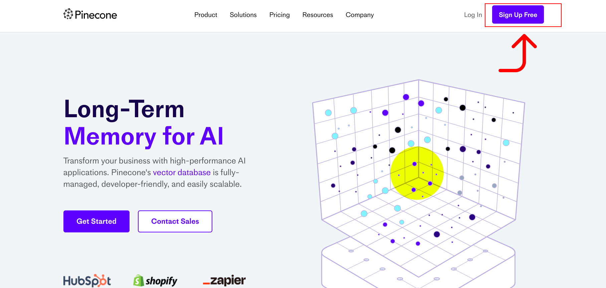
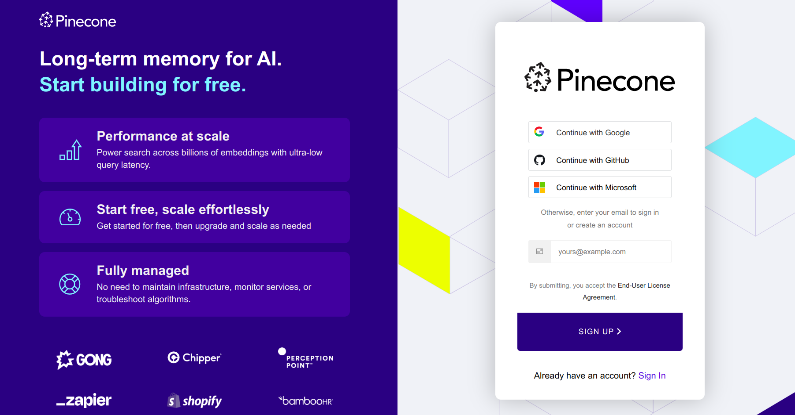
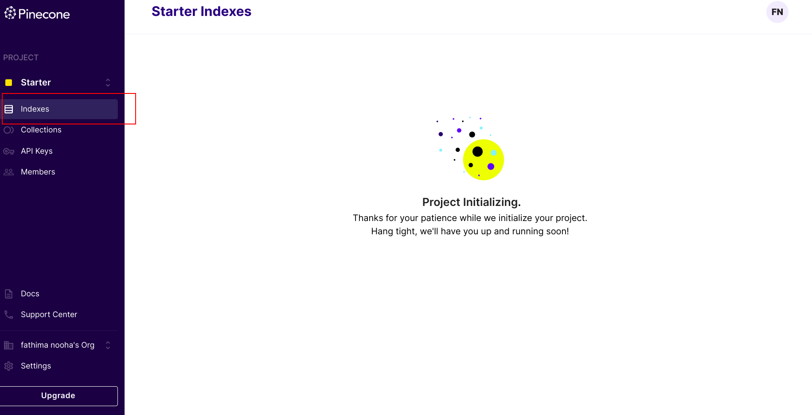
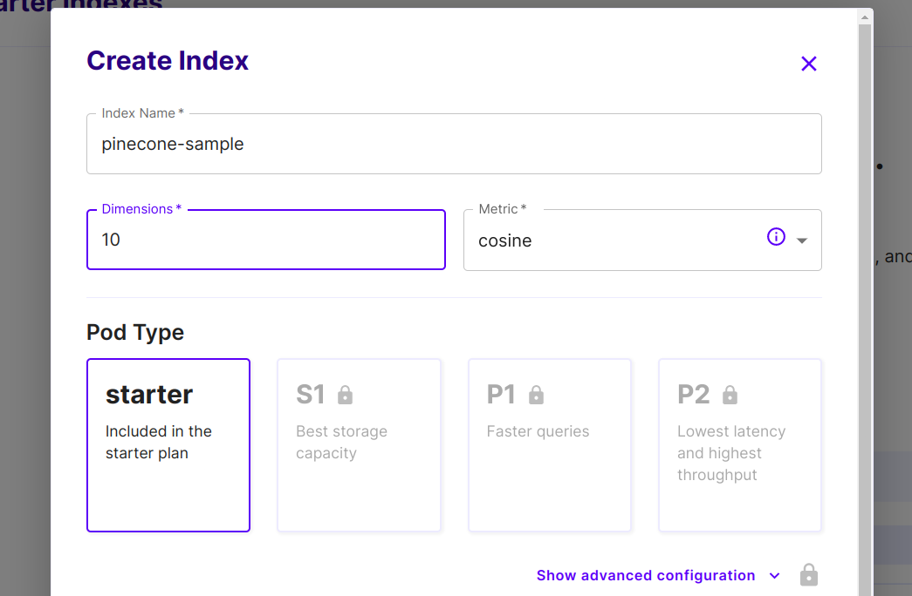
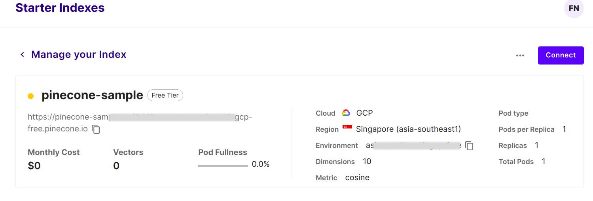

## Introduction
Pinecone is a powerful vector database designed for efficient storage and querying of high-dimensional vectors. It provides a scalable and fast solution for applications involving similarity search, recommendation systems, natural language processing, and machine learning. With its simple API, advanced indexing algorithms, and real-time capabilities, Pinecone empowers developers to build high-performance applications that rely on vector-based data, delivering near-instantaneous search results and enabling personalized user experiences.

Pinecone seamlessly integrates with EdgeChains to enhance the performance of your language models. To get started, you'll need to obtain the URL from Pinecone and configure it in your EdgeChains application. Follow the steps below to achieve this.

### Key Features
Pinecone offers a range of key features and benefits that make it a powerful tool for working with high-dimensional vectors and enabling efficient similarity search. Some of its key features include:

**Scalability:** Pinecone is designed to scale effortlessly, allowing you to handle massive amounts of data and millions to billions of vectors efficiently. It can handle high read and write throughput, making it suitable for demanding real-time applications.

**High-Performance Search:** Pinecone leverages advanced indexing algorithms to provide fast and accurate similarity search. It enables efficient nearest neighbor search, allowing you to find the most similar vectors to a given query vector with sublinear time complexity.

**Real-Time Updates:** With Pinecone, you can easily update your vector database in real-time, enabling you to handle dynamic data that changes frequently. This makes it ideal for applications that require continuous updates and real-time recommendations.

**Flexible Vector Storage:** Pinecone provides flexible options for storing and representing vectors, supporting various data types and formats. It allows you to work with diverse types of data, including numerical embeddings, textual data, images, and more.

**API and Query Language:** Pinecone offers a simple and intuitive API for managing and querying vector data. It provides a powerful query language that allows you to express complex similarity queries and filter results based on specific criteria.

### Obtaining the Pinecone URL

To get started with Pinecone and obtain your Pinecone URL, follow these steps:

**Step 1:** Visit the [Pinecone website](https://www.pinecone.io/).

If you already have an account, click on the _Login_ button in the top right corner and enter your credentials. Otherwise, click on the _Sign Up Free_ button to create a new account.



You can sign up using your email address alone, or choose to sign up with your Gmail, GitHub, or Microsoft account for a seamless registration process.



**Step 2:** Once you have logged in or signed up, you will be redirected to the dashboard where it may take a few moments to load your indexes. Please be patient during this process.

**Step 3:**  After the indexes have finished loading, you can create a new index by clicking on the _Create Index_ button.



- Provide a suitable name for your index. The name should only contain lowercase letters, numbers, and hyphens. It cannot be more than 45 characters long.
- Specify the dimension and metric for your index. The dimension refers to the length of the vectors you will be working with, and the metric determines the similarity measurement used for search operations. Choose the appropriate values for your use case.
- Once you have entered the necessary information, click on the _Create Index_ button to create your index.



**Step 4:** After the index is successfully created, you will be provided with your Pinecone URL. This URL represents the endpoint for accessing and interacting with your newly created index.



With your Pinecone URL in hand, you can now integrate Pinecone into your applications and leverage its powerful vector similarity search capabilities.

### Integration with EdgeChains

To seamlessly integrate Pinecone with EdgeChains, you can leverage the Pinecone URL obtained in the previous step and configure it in your EdgeChains application. This configuration enables your language models in EdgeChains to harness the powerful vector similarity search capabilities provided by Pinecone.

To achieve this integration, you will need to provide the following data in the `Starter class` of your `EdgeChainApplication.java` file:

- **Query Endpoint:** This endpoint allows you to send queries to Pinecone for similarity search. The URL format is ${PINECONE_URL}/query.

- **Upsert Endpoint:** Use this endpoint to insert or update vectors in your Pinecone index. The URL format is ${PINECONE_URL}/vectors/upsert.

- **Delete Endpoint:** This endpoint enables you to remove vectors from your Pinecone index. The URL format is ${PINECONE_URL}/vectors/delete.

For example, if your Pinecone URL is `https://pinecone-sample-ccc3dd8.svc.asia-southeast-gcp-free.pinecone.io`, you would configure the following variables in the Starter class of your EdgeChainApplication.java file:

``` bash
// YOUR PINECONE API KEY
private final String PINECONE_AUTH_KEY = 
"https://pinecone-sample-ccc3dd8.svc.asia-southeast-gcp-free.pinecone.io"; 
// YOUR PINECONE QUERY API
private final String PINECONE_QUERY_API = 
"https://pinecone-sample-ccc3dd8.svc.asia-southeast-gcp-free.pinecone.io/query"; 
// YOUR PINECONE UPSERT API
private final String PINECONE_UPSERT_API = 
"https://pinecone-sample-ccc3dd8.svc.asia-southeast-gcp-free.pinecone.io/upsert"; 
// YOUR PINECONE DELETE
private final String PINECONE_DELETE = 
"https://pinecone-sample-ccc3dd8.svc.asia-southeast-gcp-free.pinecone.io/delete"; 
``` 

### Additional Resources

For more information on Pinecone, tutorials, and community resources, you can refer to the following links:

- [Pinecone Documentation](https://docs.pinecone.io/)
- [Pinecone Community Forum](https://www.pinecone.io/community/)
