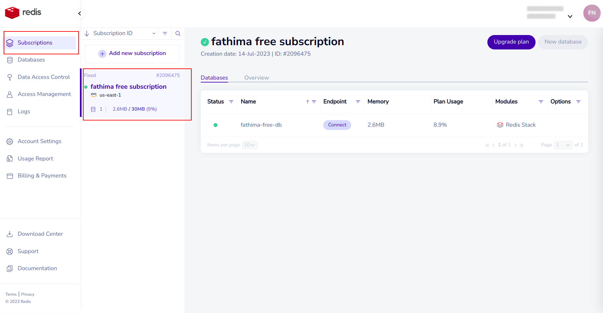
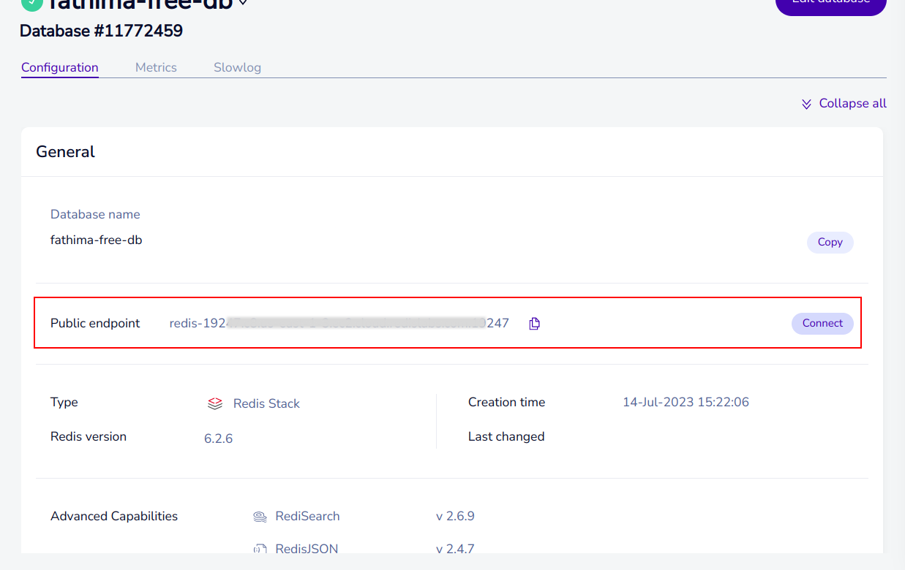

## I. Introduction
Redis is an open-source, in-memory data structure store that can be used as a database, cache, or message broker. It is known for its fast performance and versatility, making it a popular choice for various applications, including EdgeChains.

One of the key benefits of Redis is its ability to store and retrieve data in memory, which allows for extremely fast read and write operations. This makes Redis well-suited for use cases that require low-latency data access, such as real-time applications and caching. Redis supports a wide range of data structures, including strings, lists, sets, hashes, and sorted sets. This flexibility enables developers to model complex data scenarios and perform advanced operations on the data stored in Redis.

## II. Creating a free Redis Instance
To integrate Redis into your EdgeChains application, you'll first need to create a Redis instance. Follow these step-by-step instructions to create a Redis instance:

**1. Sign up for Redis:** Visit [Redis website](https://redis.com/) and click on the _Try Free_ button in the top right corner. You can sign up using your preferred email address and password, or utilize your existing Google or GitHub account for a seamless registration process. 


During the signup process, you can also select your desired cloud vendor and region and click on _Let's start free_ to continue. Once registered, you will be directed to the Redis dashboard.


**2. Access the Subscriptions Section:** In the Redis dashboard, navigate to the _Subscriptions_ section. Here, you will find information about your free subscription, which includes a storage limit of 30 MB.



**3. Configure Your Free Subscription:**. Within the Subscriptions section, click on the configuration settings for your free subscription. This will provide you with the public endpoint of your Redis instance, which is crucial for establishing a connection.



Copy the public endpoint provided in the configuration settings. The endpoint typically looks like this:

```bash
redis-19222.c1.us-east-1-3.ec2.cloud.redislabs.com:19222
```

> In this example, redis-19222 represents the hostname of the Redis server, c1 is an identifier for a specific Redis instance or deployment, us-east-1-3.ec2.cloud represents the region or data center, and 19222 is the port number.

To establish a connection to your Redis instance, you need to extract the URL and port information from the endpoint. A Redis URL follows the format: 

```bash
redis://<host>:<port>
```

where &lt;host&gt; represents the hostname or IP address of the Redis server, and&lt;port&gt represents the port number on which Redis is running. In the given example, redis-19222.c1.us-east-1-3.ec2.cloud.redislabs.com is the URL and 19222 is the port.

> You will need to take note of the Redis URL and port to use them in your EdgeChains application.

By obtaining the Redis endpoint, you will have the necessary information to establish a connection to your Redis instance and start utilizing its features.


