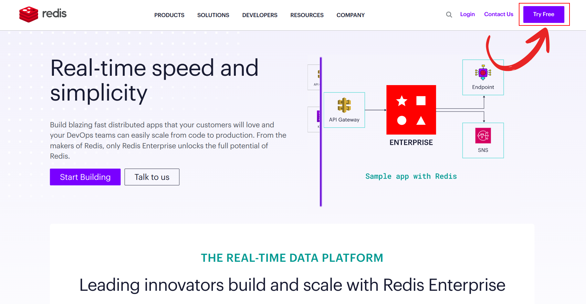
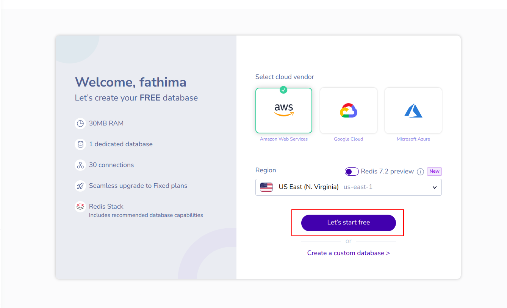

## I. Introduction
Redis is an open-source, in-memory data structure store that can be used as a database, cache, or message broker. It is known for its fast performance and versatility, making it a popular choice for various applications, including EdgeChains.

One of the key benefits of Redis is its ability to store and retrieve data in memory, which allows for extremely fast read and write operations. This makes Redis well-suited for use cases that require low-latency data access, such as real-time applications and caching. Redis supports a wide range of data structures, including strings, lists, sets, hashes, and sorted sets. This flexibility enables developers to model complex data scenarios and perform advanced operations on the data stored in Redis.

## II. Creating a free Redis Instance
To get started with Redis in EdgeChains, you'll need to create a Redis instance. Follow these step-by-step instructions to create a Redis instance:
1. Sign in to the Redis site or dashboard using your credentials. If you do not have an account already, visit [Redis website](https://redis.com/) and click on Try Free in the top left corner. You have the option to sign up using your preferred email address and password, or alternatively, you can utilize your existing Google or github account for a seamless registration process.

During the signing up process, you can also select a cloud vendor and region of your choice, and click on _Let's start free_ to continue. You will be directed to the redis dashboard. 

2. Once logged in, locate the option to create a new instance. This may be labeled as "Create Instance.
3. Choose the desired configuration for your Redis instance. This includes selecting the instance size, region, and any other relevant settings based on your requirements.
4. Set a meaningful name for the Redis instance.
5. Specify any additional settings that are applicable to your use case. For example, you may want to configure persistence options or enable replication for high availability.
6. Take a moment to review the configuration details you've provided. Ensure that everything is as per your requirements and preferences.
7. Once you've reviewed the configuration, confirm the creation of the Redis instance. This may involve clicking a "Create" or "Confirm" button, depending on the Redis dashboard interface.

## V. Obtaining Connection Details
After successfully creating a Redis instance, you need to obtain the connection details required to connect to it. Here's how you can retrieve the Redis URL, port, and password:

By default, redis-cli connects to the server at the address 127.0.0.1 with port 6379. You can change the port using several command line options. To specify a different host name or an IP address, use the -h option.

1. Access the Redis site or dashboard
2. Navigate to the instance details or settings
3. Locate the Redis URL, port, and password
4. Highlight the importance of keeping these details secure

By following these steps, you can create a free Redis instance and obtain the necessary connection details to use Redis effectively in your EdgeChains or other applications.   

