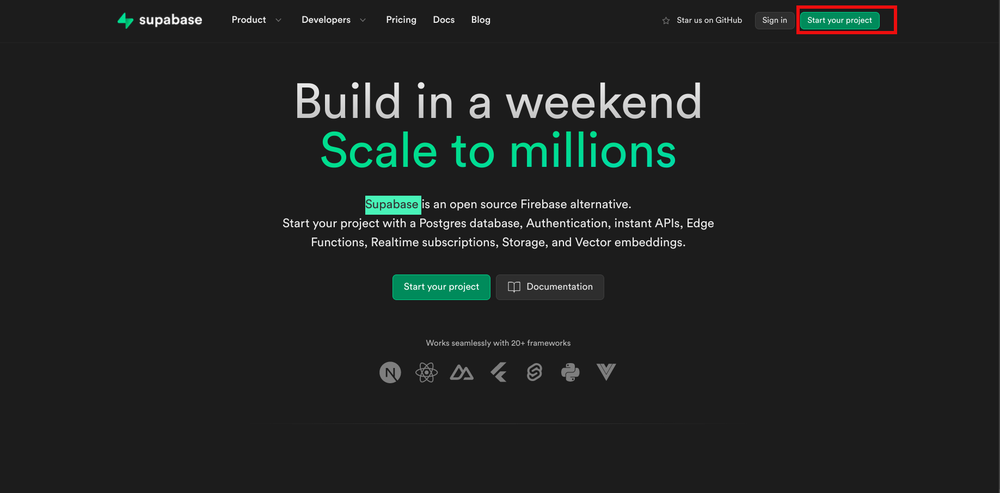
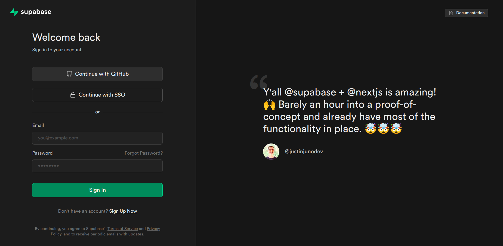
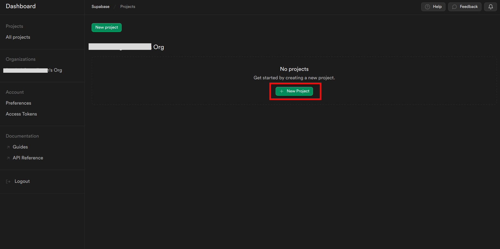
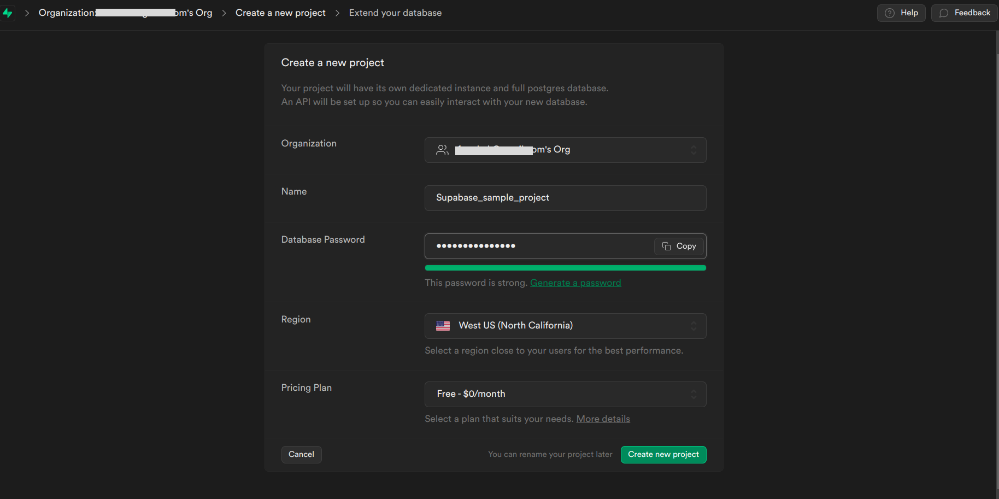
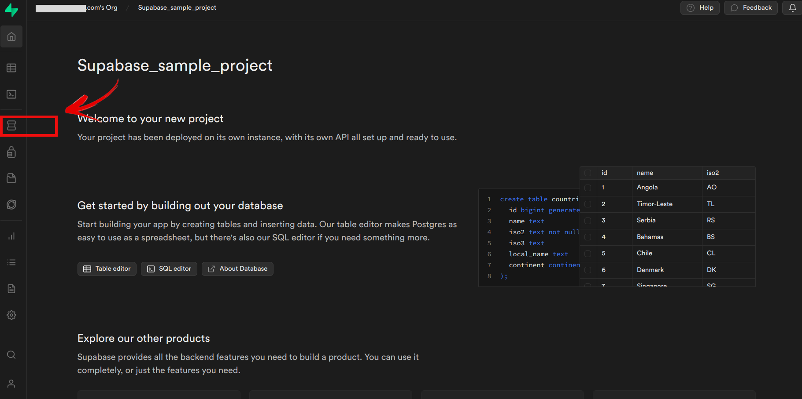
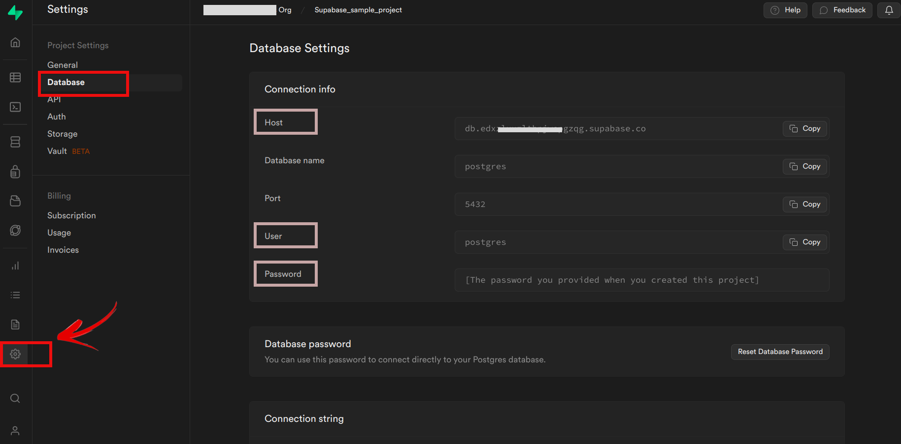
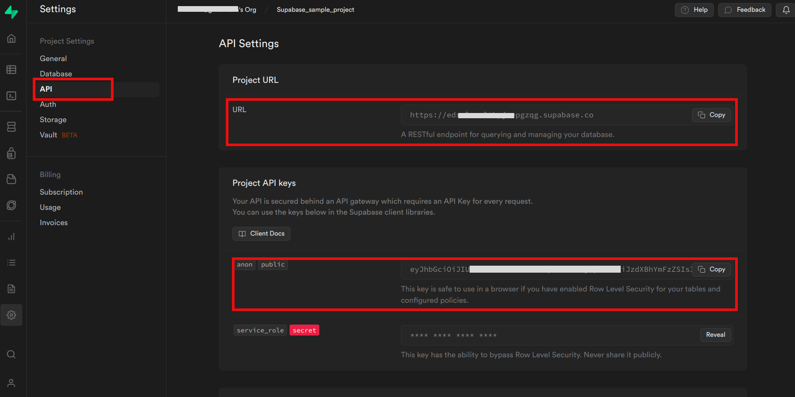
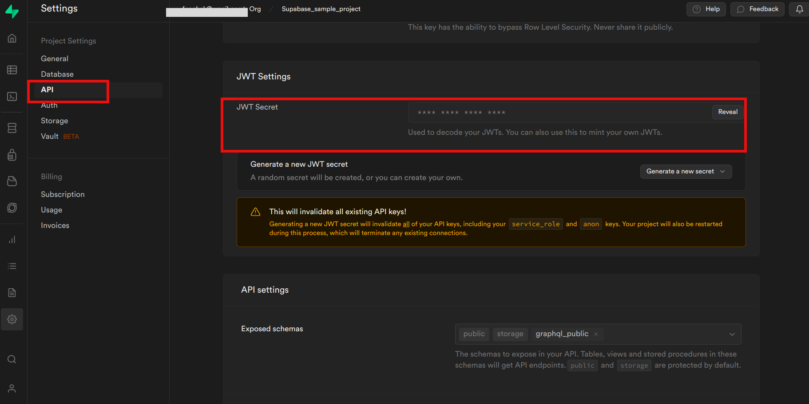

## Introduction
**Supabase** is a powerful, open-source platform that simplifies the creation of secure and high-performance Postgres backends, offering functionalities similar to Firebase, such as authentication and real-time database. When used with **EdgeChains**, Supabase enhances the backend capabilities of applications built with the framework, enabling developers to create advanced and interactive applications powered by large language models.

## Supabase Integration with EdgeChains

In the EdgeChains configuration, the following parameters need to be configured for Supabase integration:

- **SupabaseURL**: The URL of the Supabase backend, which allows EdgeChains to communicate with the Supabase service.

- **Supabase AnnonKey**: The anonymous key used for authentication when interacting with the Supabase backend.

- **Supabase JWTSecret**: The JSON Web Token (JWT) secret for secure communication and user authentication.

- **Supabase DBhost:**: The JDBC URL for connecting to the PostgreSQL database in Supabase. This URL provides the necessary information to establish a connection to the database. (jdbc:postgresql://${SUPABASE_DB_URK}/postgres)

- **DbUsername**: The username for the PostgreSQL database in Supabase. In this example, it is set to "postgres."

- **DbPassword**: The password for the PostgreSQL database in Supabase, which is required for authentication and access to the database.

By providing the appropriate values for these configuration parameters, EdgeChains can seamlessly integrate with Supabase, enabling developers to leverage the features and functionalities of Supabase as the backend for their language model-powered applications.

---
## How to Get Configuration Parameters for Supabase Integration

To integrate Supabase with EdgeChains and obtain the necessary configuration parameters, follow these step-by-step instructions:

**Step 1: Visit the Supabase website**

- If you already have an account, click on the _Dashboard_ button in the top right corner and  and log in using your credentials.
- If you don't have an account, click on the _Sign in_ button to either log in or create a new account.

- You can sign up using your email address or opt for a seamless registration process using your GitHub or SSO credentials.

**Step 2: Create a New Project**

- After logging in or signing up, you will be directed to the dashboard. Click on the _New project_ button to initiate the project creation process.

- Enter the necessary details for the database, including the Name, and set up a strong password for added security.
- Select your preferred region. For the free pricing plan, choose the default option.

- Finally, click on the _Create new project_ button to have Supabase set up your new project.

**Step 3: Access Project Settings**

- After your project is set up, go to the databases section and then proceed to the settings section of the database.

- In this section, you will find the Host, User, and Password, which you need to take note of for using with EdgeChains. These parameters will facilitate the integration of Supabase with EdgeChains and enable seamless communication between the two platforms.

**Step 4: Obtain API Credentials**

- In the Supabase dashboard, navigate to the API section, where you can access the required URL and anonymous key.

- Continue scrolling down to find the JWT settings, where you can obtain the JWT secret as well.

By following these steps and obtaining the necessary configuration parameters, you will successfully integrate Supabase with EdgeChains. These parameters will enable you to leverage Supabase's powerful features as the backend for your language model-powered applications, creating secure and high-performance Postgres backends with ease.

---
