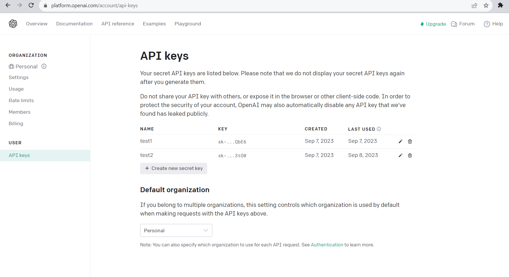
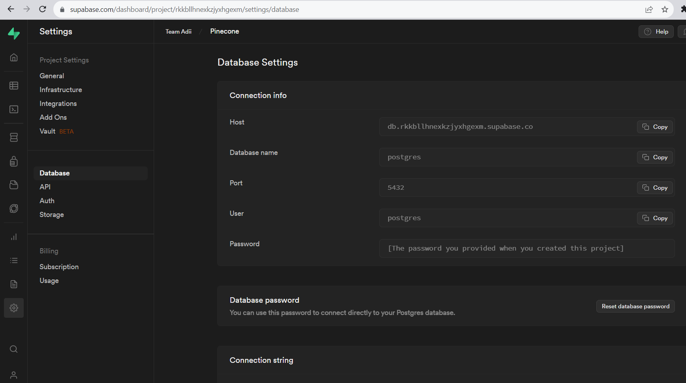
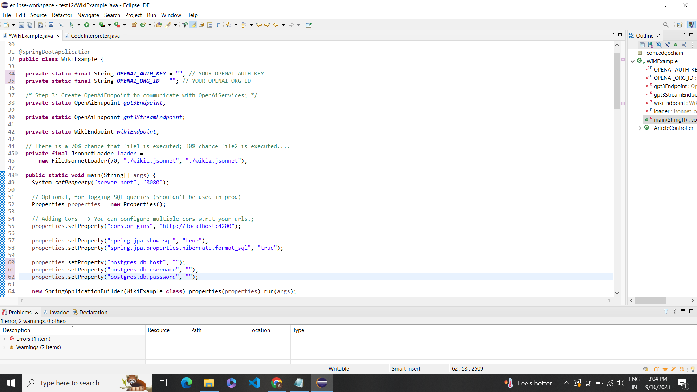
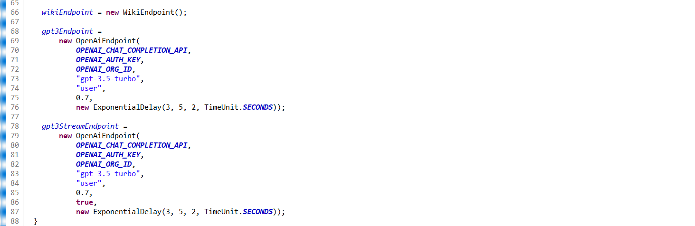
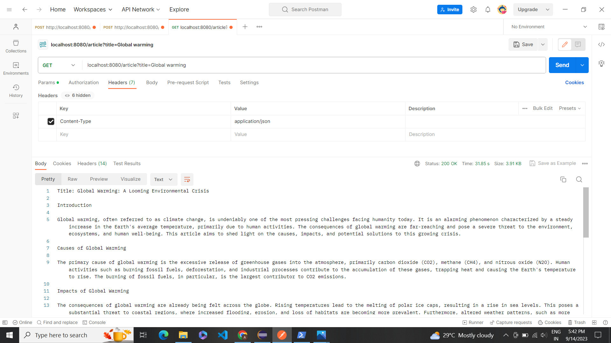

# How to: Build a Article Writer Prompt with EdgeChains !

**Generates an article for you using OpenAI API in Java and EdgeChain.**

Consider you have to write an article about Global Warming:
Normally you have to find information about it in various websites, but this particular model helps you in generating the article by just providing the title of the article.
EdgeChain is a streamlined solution for developing GenAI applications, offering simplicity through a single script file and jsonnet file setup. It emphasizes versioning for prompts, automatic parallelism across various processors, fault tolerance, and scalability, making it a robust choice for chain-of-thought applications with extensive API integration and data sets. While LangChain primarily focuses on a specific set of principles, EdgeChain takes a unique stance, emphasizing declarative prompt and chain orchestration as pivotal components of its architecture. To delve deeper into EdgeChain and explore its capabilities, you can refer to GitHub repository [https://github.com/arakoodev/edgechains#why-do-you-need-declarative-prompt--chain-orchestration-](https://github.com/arakoodev/edgechains#why-do-you-need-declarative-prompt--chain-orchestration-). This platform offers a comprehensive view of EdgeChains' vision and how it differentiates itself from LangChain.

## Pre Requisites

1. You need to make an account in OpenAI, Postgres so that from there you can retrieve the AUTH key, org id and etc. which are needed for the code.

2.  You need to download the edgechains jar file from this url https://github.com/arakoodev/EdgeChains/releases.
3. Download the .java and .jsonnet file and put them in the same folder.  
4. In the code according to the folder structure you have to write about the path.
 

## Configuration of the Database

1.  Go to the Supabase website ([https://supabase.io](https://supabase.io)) and sign up for an account.
2.  Create a new Project by clicking the “New Project” button.
3. Configure your project settings including the project name, region, and the plan.
4.  Once your project is created, you’ll be directed to the project dashboard.
5. Click the “Create Database” button to create a new PostgreSQL database.
6. After the database is created, you can access its credentials, including the database URL, API URL and service role key.


## Explanation of the Code 

 -  Load the edgechains package.  
 - Import the OPENAI_Chat_Completion API. Here we have to import the static constants from other classes. These classes are  of OpenAI.
 - Import the Spring Framework related classes and annotations.  
 -   The code relies on external libraries and dependencies, such as  `com.edgechain.lib`  and  `io.reactivex.rxjava3`.These dependencies provide additional functionality and utilities for the code.
 - Classes such as   `OpenAiEndpoint`,  `WikiEndpoint`,  `ArkRequest`, and  `CompletionRequest` are used to interact with specific endpoints or APIs, such as OpenAI and Wikipedia.
 - RxJava and Retry Logic: The code uses RxJava and includes classes like  `ExponentialDelay`  and  `EdgeChain`.These are used for implementing retry logic and handling asynchronous operations.
 - The code includes a constant  `OPENAI_CHAT_COMPLETION_API`, which represents the endpoint for OpenAI chat completion.
 - A class named  `WikiExample`  is present that includes several static variables and a  `JsonnetLoader`  instance. Here's an explanation of the that:

 - Static Variables:

    -   `OPENAI_AUTH_KEY`: This variable represents the OpenAI authentication key. It is a string that should be replaced with your actual OpenAI authentication key.
    -   `OPENAI_ORG_ID`: This variable represents the OpenAI organization ID. It is a string that should be replaced with your actual OpenAI organization ID.
    -   `gpt3Endpoint`: This variable is an instance of the  `OpenAiEndpoint`  class, which is used to communicate with OpenAI services.
    -   `gpt3StreamEndpoint`: This variable is another instance of the  `OpenAiEndpoint`  class, which is likely used for streaming communication with OpenAI services.
    -   `wikiEndpoint`: This variable is an instance of the  `WikiEndpoint`  class, which is used to communicate with the Wikipedia API.
 - JsonnetLoader


    -   `loader`: This variable is an instance of the  `JsonnetLoader`  class, which is used to load and process Jsonnet files.
    -   `FileJsonnetLoader`: This class is a specific implementation of the  `JsonnetLoader`  interface that loads Jsonnet files from the file system.
    -   The  `FileJsonnetLoader`  constructor takes three arguments:
        -   The first argument represents the probability (in percentage) of executing the first file (`./wiki1.jsonnet`). In this case, there is a 70% chance of executing  `./wiki1.jsonnet`.
        -   The second argument is the path to the first Jsonnet file (`./wiki1.jsonnet`).
        -   The third argument is the path to the second Jsonnet file (`./wiki2.jsonnet`).

The purpose of this code is to create an instance of  `FileJsonnetLoader`  that loads Jsonnet files with a certain probability. Depending on the probability, either  `./wiki1.jsonnet`  or  `./wiki2.jsonnet`  will be executed.

 - The main method is the entry point of the application.
 -      Setting Server Port:
    -   `System.setProperty("server.port", "8080")`: This line sets the server port to 8080. It configures the application to listen on port 8080 for incoming requests.

 -     Configuring Properties:
    -   `Properties properties = new Properties()`: This line creates a new instance of the  `Properties`  class, which is used to store key-value pairs of configuration properties.
    -   `properties.setProperty("cors.origins", "http://localhost:4200")`: This line sets the CORS (Cross-Origin Resource Sharing) origins property to allow requests from  `http://localhost:4200`. CORS is used to control access to resources from different origins.

 -     Configuring JPA and Hibernate Properties:
    -   `properties.setProperty("spring.jpa.show-sql", "true")`: This line sets the property to show SQL queries executed by JPA (Java Persistence API).
    -   `properties.setProperty("spring.jpa.properties.hibernate.format_sql", "true")`: This line sets the property to format the SQL queries executed by Hibernate.

 -     Configuring PostgreSQL Database Properties:
    -   `properties.setProperty("postgres.db.host", "jdbc:postgresql://db.rkkbllhnexkzjyxhgexm.supabase.co:5432/postgres")`: This line sets the PostgreSQL database host URL.
    -   `properties.setProperty("postgres.db.username", "postgres")`: This line sets the username for the PostgreSQL database.
    -   `properties.setProperty("postgres.db.password", "jtGhg7?JLhUF$fK")`: This line sets the password for the PostgreSQL database.

 -     Starting the Spring Boot Application:
    -   `new SpringApplicationBuilder(WikiExample.class).properties(properties).run(args)`: This line creates a new instance of  `SpringApplicationBuilder`  with the  `WikiExample`  class as the main application class. It sets the configured properties and runs the Spring Boot application.

 -     Initializing Endpoints:
    -   `wikiEndpoint = new WikiEndpoint()`: This line creates an instance of the  `WikiEndpoint`  class, which is used to communicate with the Wikipedia API.
    -   `gpt3Endpoint = new OpenAiEndpoint(...)`: This line creates an instance of the  `OpenAiEndpoint`  class, which is used to communicate with OpenAI services. It sets various parameters such as the OpenAI chat completion API, authentication key, organization ID, model, temperature, and delay.
    -   `gpt3StreamEndpoint = new OpenAiEndpoint(...)`: This line creates another instance of the  `OpenAiEndpoint`  class, which is likely used for streaming communication with OpenAI services. It sets similar parameters as the  `gpt3Endpoint`, but with an additional flag for streaming.

## Article Writer Controller

 - It is a `RestController`  class named  `ArticleController`  that handles HTTP GET requests for the  `/article`  endpoint. Here's an explanation of the code within the class:

1.  `@RestController`  Annotation:
    -   This annotation is used to indicate that the class is a REST controller, which means it handles HTTP requests and returns the response in a RESTful manner.

2.  `@GetMapping("/article")`  Annotation:
    -   This annotation is used to map the HTTP GET requests with the  `/article`  endpoint to the  `generateArticle`  method.

3.  `generateArticle`  Method:
    -   This method is responsible for generating an article based on the provided query parameter.
    -   It takes an  `ArkRequest`  object as a parameter, which is likely a custom request object that contains query parameters.
    -   The method throws an  `Exception`  if any error occurs during the generation process.

4.  Generating the Prompt:
    -   The method prepares a prompt for the article generation by concatenating the string "Write an article about " with the value of the  `title`  query parameter from the  `arkRequest`  object.

5.  Sending a Request to the OpenAI API:
    -   The method uses the  `gpt3Endpoint`  instance (which is an instance of the  `OpenAiEndpoint`  class) to send a request to the OpenAI API for generating the article.
    -   It uses the  `chatCompletion`  method of the  `gpt3Endpoint`  to perform the chat completion.
    -   The  `chatCompletion`  method takes the prompt, a chat model name ("React-Chain"), and the  `arkRequest`  object as parameters.
    -   The generated article is stored in the  `gptre`  variable.

6.  Returning the Generated Article:
    -   The method returns the generated article as a response to the HTTP GET request.

## Postman Testing
After all this we will be using the postman to test and give the requests for the same in the following manner:
**Title**
* Description: Perform a query to retrieve results from Open AI.
*  Method: POST 
* URL:[localhost:8080/article?title=Global warming](http://localhost:8080/pinecone/upsert?namespace=machine-learning) 
* Headers: Content-Type: application/json
* Body: raw



### Full Working Code

```java
package com.edgechain;

import com.edgechain.lib.endpoint.impl.OpenAiEndpoint;
import com.edgechain.lib.endpoint.impl.WikiEndpoint;
import com.edgechain.lib.jsonnet.JsonnetArgs;
import com.edgechain.lib.jsonnet.JsonnetLoader;
import com.edgechain.lib.jsonnet.enums.DataType;
import com.edgechain.lib.jsonnet.impl.FileJsonnetLoader;
import com.edgechain.lib.openai.response.ChatCompletionResponse;
import com.edgechain.lib.request.ArkRequest;
import com.edgechain.lib.response.ArkResponse;
import com.edgechain.lib.rxjava.retry.impl.ExponentialDelay;
import com.edgechain.lib.rxjava.transformer.observable.EdgeChain;
import com.edgechain.lib.openai.request.CompletionRequest;


import io.reactivex.rxjava3.core.Observable;
import java.util.*;
import java.util.concurrent.TimeUnit;

import com.edgechain.lib.wiki.response.WikiResponse;
import org.springframework.boot.autoconfigure.SpringBootApplication;

import org.springframework.boot.builder.SpringApplicationBuilder;
import org.springframework.web.bind.annotation.GetMapping;
import org.springframework.web.bind.annotation.RestController;
import org.springframework.web.bind.annotation.RequestParam;

import static com.edgechain.lib.constants.EndpointConstants.OPENAI_CHAT_COMPLETION_API;

@SpringBootApplication
public class WikiExample {

  private static final String OPENAI_AUTH_KEY = ""; // YOUR OPENAI AUTH KEY
  private static final String OPENAI_ORG_ID = ""; // YOUR OPENAI ORG ID

  /* Step 3: Create OpenAiEndpoint to communicate with OpenAiServices; */
  private static OpenAiEndpoint gpt3Endpoint;

  private static OpenAiEndpoint gpt3StreamEndpoint;

  private static WikiEndpoint wikiEndpoint;

  // There is a 70% chance that file1 is executed; 30% chance file2 is executed....
  private final JsonnetLoader loader =
      new FileJsonnetLoader(70, "./wiki1.jsonnet", "./wiki2.jsonnet");

  public static void main(String[] args) {
    System.setProperty("server.port", "8080");

    // Optional, for logging SQL queries (shouldn't be used in prod)
    Properties properties = new Properties();

    // Adding Cors ==> You can configure multiple cors w.r.t your urls.;
    properties.setProperty("cors.origins", "http://localhost:4200");

    properties.setProperty("spring.jpa.show-sql", "true");
    properties.setProperty("spring.jpa.properties.hibernate.format_sql", "true");

    properties.setProperty("postgres.db.host", "");
    properties.setProperty("postgres.db.username", "");
    properties.setProperty("postgres.db.password", "");

    new SpringApplicationBuilder(WikiExample.class).properties(properties).run(args);

    wikiEndpoint = new WikiEndpoint();

    gpt3Endpoint =
        new OpenAiEndpoint(
            OPENAI_CHAT_COMPLETION_API,
            OPENAI_AUTH_KEY,
            OPENAI_ORG_ID,
            "gpt-3.5-turbo",
            "user",
            0.7,
            new ExponentialDelay(3, 5, 2, TimeUnit.SECONDS));

    gpt3StreamEndpoint =
        new OpenAiEndpoint(
            OPENAI_CHAT_COMPLETION_API,
            OPENAI_AUTH_KEY,
            OPENAI_ORG_ID,
            "gpt-3.5-turbo",
            "user",
            0.7,
            true,
            new ExponentialDelay(3, 5, 2, TimeUnit.SECONDS));
  }
  @RestController
  public class ArticleController {
	  @GetMapping("/article")
      public String generateArticle(ArkRequest arkRequest) throws Exception {
          // Prepare the prompt
          String prompt = "Write an article about " + arkRequest.getQueryParam("title") + ".";

          // Use the OpenAiService to send a request to the OpenAI API
          // GPT-3 model is used with the provided prompt, max tokens is set to 500 for the article length
          // and temperature is set to 0.7 which is a good balance between randomness and consistency
          // Echo is set to true to include the prompt in the response
          /*CompletionRequest completionRequest = CompletionRequest.builder()
                  .prompt(prompt)
                  .model("gpt-3.5-turbo")
                  .maxTokens(500)
                  .temperature(0.7)
                  //.echo(true)
                  .build();*/
          String gptre=new EdgeChain<>(gpt3Endpoint.chatCompletion(prompt, "React-Chain", arkRequest))
                  .get()
                  .getChoices()
                  .get(0)
                  .getMessage()
                  .getContent();
          // Send the request
          //ChatCompletionResponse response = gpt3Endpoint.chat(completionRequest);
          //Observable<ChatCompletionResponse> response = gpt3Endpoint.chatCompletion(completionRequest.getPrompt(), "", arkRequest);

          // Extract the generated text from the response
          //String generatedArticle = response.getChoices().get(0).getGeneratedText();
          //return response.blockingFirst().getChoices().get(0).toString();
          return gptre;

          // Return the generated article
//          return generatedArticle;
      }
  }
}
```
