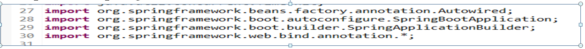
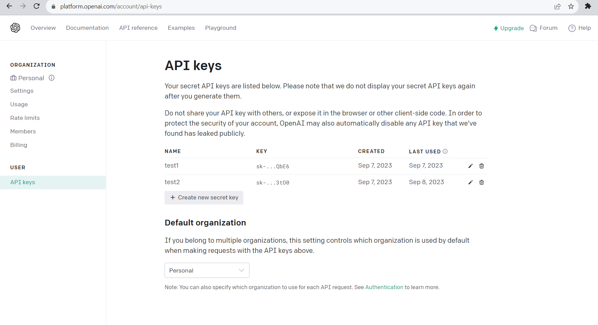
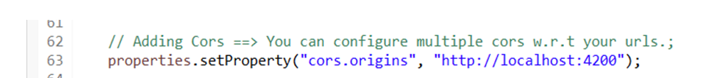
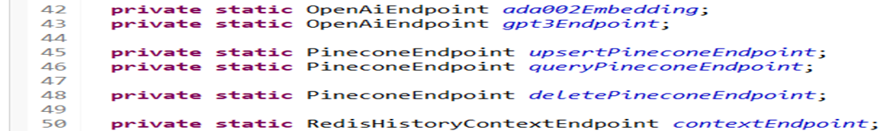
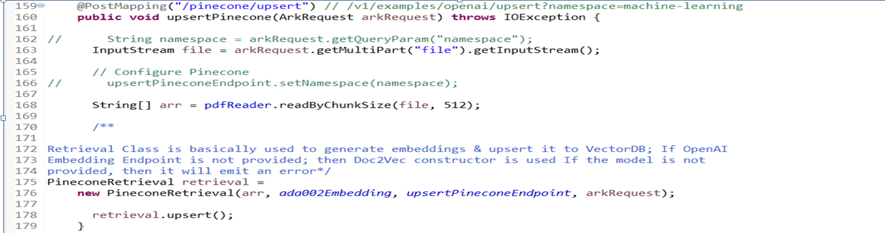
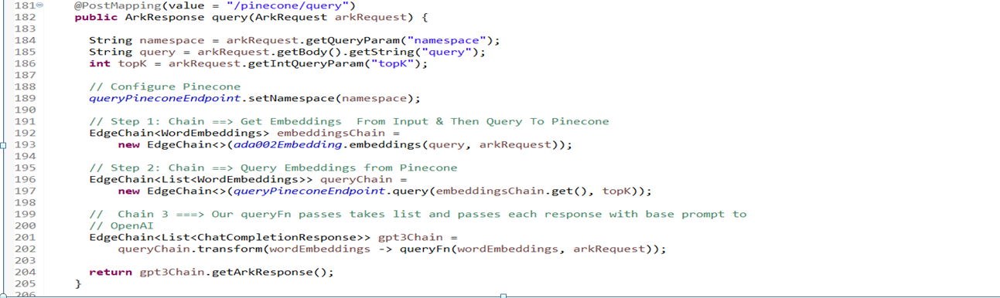
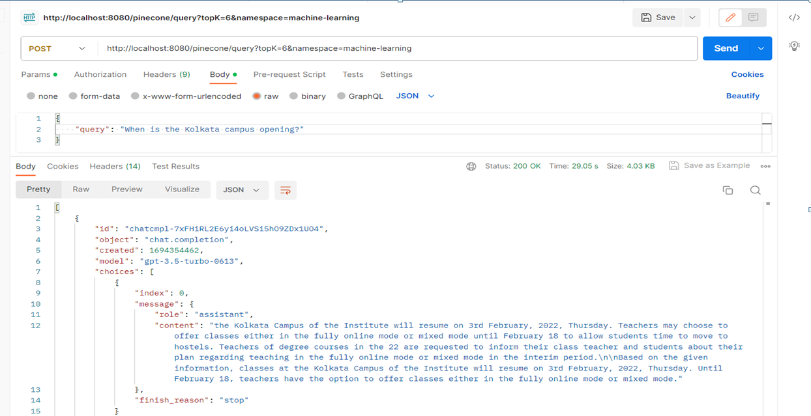

# How to Build Semantic Search using EdgeChains.

Search for your document from a large pack of existing documents in the most effective manner.

Consider you have a notice of opening of campus of some Institute :  
You want to find a particular campus that is similar to some campuses of Kolkata. The best effective way to do so would be by using the Semantic Search.

Semantic Search is the task of retrieving the documents from a collection of the documents in response to a query asked .It allows you to access the best matches from your document collection within seconds and the best thing is the fact is on the basis of meaning rather than keyword matches .A Semantic Search model has been created using Java.  
[Edgechains](https://github.com/arakoodev/edgechains) is a streamlined solution for developing GenAI applications, offering simplicity through a single script file and jsonnet file setup. It emphasizes versioning for prompts, automatic parallelism across various processors, fault tolerance, and scalability, making it a robust choice for chain-of-thought applications with extensive API integration and data sets. While Langchain primarily focuses on a specific set of principles, EdgeChains takes a unique stance, emphasizing declarative prompt and chain orchestration as pivotal components of its architecture. To delve deeper into EdgeChains and explore its capabilities, you can refer to our [GitHub repository](https://github.com/arakoodev/edgechains#why-do-you-need-declarative-prompt--chain-orchestration-) . 
### Pre Requisites

1.  You need to make an account in OPENAI, Pinecone, Postgres so that from there you can retrieve the auth key, org id and etc which are needed for the code.  
2.  You need to download the edgechains jar file from this url https://github.com/arakoodev/EdgeChains/releases.  
3. Download the `.java` and `.jsonnet` file and put them in the same folder.  
4. In the code according to the folder structure you have to write about the path.  
  
  

### Configuration of the Database:

1.  Go to the Supabase website ([https://supabase.io](https://supabase.io)) and sign up for an account.
    
2.  Create a new Project by clicking the “New Project” button.
    
3.  Configure your project settings including the project name, region, and the plan.
    
4.  Once your project is created, you’ll be directed to the project dashboard.
    
5.  Click the “Create Database” button to create a new PostgreSQL database.
    
6.  After the database is created, you can access its credentials, including the database URL, API URL and service role key.  
    

### Explanation of the Code

1. Load the edgechains package.  
2. Import the OPENAI_Chat_Completion API. Here we have to import the static constants from other classes. These classes are Pinecone, OpenAI, and PDF reading.  
3. Import the Spring Framework related classes and annotations.  

4. Fill in the details of the `auth key`, `org_id` and others of OpenAI and Pinecone.  

5. Create variables that may be interacting with the OpenAI services used to store authentication keys and API endpoints.  
6. Load the jsonnet file into the variable, and then load the data of that file into the variable.  
7. In the main method, set the system server port to the desired port or by default it is `8080`. `Properties properties = new Properties ();` this property is often used in Java to manage the key-value pairs.  
8. Then you have to configure the Hibernate to format the SQL queries for better readability. The lines written below are used to access the database. They enable SQL query logging and formatting in Spring JPA (Java Persistence API).


9. Set the CORS (Cross-Origin Resource Sharing) by specifying the allowed origins.  
10. Then you have to initialize several endpoints and related configurations.  
* `ada002Embedding`: This variable is an instance of the `OpenAiEndpoint` class, which is used to interact with OpenAI for text embeddings.  It is a configuration object that allows your Java code to communicate with OpenAI's text embedding service using the ***"Ada 002"*** model and handle authentication and retry logic. It's a part of integrating OpenAI's capabilities into your application for NLP tasks.  
* `gpt3Endpoint`: This variable is another instance of the OpenAiEndpoint class, configured for GPT-3.5 Turbo, a language model for chat completions. It has similar configuration parameters as ada002Embedding but with additional settings for chat completions.  It is a configuration object that facilitates communication with OpenAI's ***"GPT-3.5 Turbo"*** model for chat-based language generation tasks. 
*  `upsertPineconeEndpoint`: This variable is an instance of the `PineconeEndpoint` class, which is used to interact with Pinecone for upserting vectors. It is a configuration object that enables your application to interact with the Pinecone service for adding or updating vectors in a vector index. It plays a crucial role in enabling similarity-based search and retrieval functionality in your application.  
These variables are essential for communicating with external services such as OpenAI and Pinecone.  

11. After this, define a Spring class which is responsible for handling the HTTP requests and contains various methods for interacting with Pinecone and OpenAI services.
12. Inject a `PdfReader` instance into the controller so that it can be used to read PDF files in the code. 
 
### Upsert Controller  
Create a method `upsertPinecone` that handles HTTP POST requests to the endpoint which takes an `ArkRequest` object as a parameter which contains data required for the operation. Here `pdfReader` is used to read the input stream in chunks of 512 bytes and stores the result in a string array. An instance of `PineconeRetrieval` is created passing the string array created, the `ada002Embedding` endpoint, the `upsertPineconeEndpoint` and the `arkRequest`. The `upsert` method of the `PineconeRetrieval` instance is called to upsert the data into Pinecone. The pdf that you uploaded is divided into chunks and then the embedding vector sends that to the embedding endpoint to perform the similarity search on the query sent. 
**NOTE**: Upsert is done only once as you can upload as many pdf files one at a time as after upserting the major work you would be doing is querying.  

### Query Controller
Define a method ‘query’ to handle HTTP POST requests to the `/pinecone/query` endpoint. It extracts the various parameters such as `namespace`, `query` from the `arkRequest` object. Here EdgeChain performs a Pinecone query using the `queryPineconeEndpoint` and retrieves word embeddings. This helps in transforming the results of the query into a list of the objects using a method. It returns the response containing the result of the query. `topk` is used to divide the pdf into chunks.  
  
Overall this model manages the interaction with Pinecone and OpenAI services including upserting data, querying based on the received HTTP requests.

  

### Postman Testing

After all this we will be using the postman to test and give the requests for the same in the following manner:  
1. **Upsert**
   *    Description: Upload a file to update Open AI data in the Pinecone namespace.
    
   *  Method: POST
    
    *  URL:[http://localhost:8080/pinecone/upsert?namespace=machine-learning](http://localhost:8080/pinecone/upsert?namespace=machine-learning)
    
   *   Headers: Content-Type: multipart/form-data
    
   *   Body:  
       * Mode: formdata  
        * Key: file  
        * Type: file
    

Also one of the important to consider while uploading the files, upload only in pdf format, json format is not allowed. You can only upload one pdf file at a time.


2. **Query**

   -   Description: Perform a query to retrieve results from Open AI in the Pinecone namespace.
    
   -   Method: POST
    
   -   URL:http://localhost:8080/pinecone/query?topK=6&namespace=machine-learning
    
   -   Headers: Content-Type: application/json  
      
    
    -   Body:  
       * Mode: raw  
      *   Data:  `{"query": "When is the Kolkata campus opening?"  }`



Semantic Search can change the way searching, ranking or retrieval systems work with their ability to index and store embedding vectors. Here EdgeChain helps in inserting the chunk and calculating the embedding vector. It provides methods which make it very easy for the customer so that they have just to write the business logic and their work happens easily, instead EdgeChain does everything. It ranks according to the score where the score is according to how close their similarity is with the query. And the model will return the answer of the query according to the ranking.

The Full Working Code of the Model is.  

```java
package com.edgechain;

import static com.edgechain.lib.constants.EndpointConstants.OPENAI_CHAT_COMPLETION_API;
import static com.edgechain.lib.constants.EndpointConstants.OPENAI_EMBEDDINGS_API;

import com.edgechain.lib.chains.PineconeRetrieval;
import com.edgechain.lib.context.domain.HistoryContext;
import com.edgechain.lib.embeddings.WordEmbeddings;

import com.edgechain.lib.endpoint.impl.context.RedisHistoryContextEndpoint;
import com.edgechain.lib.endpoint.impl.embeddings.OpenAiEmbeddingEndpoint;
import com.edgechain.lib.endpoint.impl.index.PineconeEndpoint;
import com.edgechain.lib.endpoint.impl.llm.OpenAiChatEndpoint;
import com.edgechain.lib.jsonnet.JsonnetArgs;
import com.edgechain.lib.jsonnet.JsonnetLoader;
import com.edgechain.lib.jsonnet.enums.DataType;
import com.edgechain.lib.jsonnet.impl.FileJsonnetLoader;
import com.edgechain.lib.openai.response.ChatCompletionResponse;
import com.edgechain.lib.reader.impl.PdfReader;
import com.edgechain.lib.request.ArkRequest;
import com.edgechain.lib.response.ArkResponse;
import com.edgechain.lib.rxjava.retry.impl.ExponentialDelay;
import com.edgechain.lib.rxjava.transformer.observable.EdgeChain;
import java.io.IOException;
import java.io.InputStream;
import java.util.*;
import java.util.concurrent.TimeUnit;
import org.springframework.beans.factory.annotation.Autowired;
import org.springframework.boot.autoconfigure.SpringBootApplication;
import org.springframework.boot.builder.SpringApplicationBuilder;
import org.springframework.web.bind.annotation.*;

@SpringBootApplication
public class PineconeExample {

  private static final String OPENAI_AUTH_KEY = ""; // YOUR OPENAI AUTH KEY
  private static final String OPENAI_ORG_ID = ""; // YOUR OPENAI ORG ID

  private static final String PINECONE_AUTH_KEY = "";
  private static final String PINECONE_API = ""; // Only API
  private static OpenAiChatEndpoint gpt3Endpoint;
  private static OpenAiChatEndpoint gpt3StreamEndpoint;

  private static PineconeEndpoint pineconeEndpoint;

  private static RedisHistoryContextEndpoint contextEndpoint;

  // It's recommended to perform localized instantiation for thread-safe approach.
  private JsonnetLoader queryLoader = new FileJsonnetLoader("./pinecone/pinecone-query.jsonnet");
  private JsonnetLoader chatLoader = new FileJsonnetLoader("./pinecone/pinecone-chat.jsonnet");

  public static void main(String[] args) {
    System.setProperty("server.port", "8080");
    Properties properties = new Properties();

    properties.setProperty("spring.jpa.show-sql", "true");
    properties.setProperty("spring.jpa.properties.hibernate.format_sql", "true");

    // Adding Cors ==> You can configure multiple cors w.r.t your urls.;
    properties.setProperty("cors.origins", "http://localhost:4200");

    // Redis Configuration
    properties.setProperty("redis.url", "");
    properties.setProperty("redis.port", "");
    properties.setProperty("redis.username", "default");
    properties.setProperty("redis.password", "");
    properties.setProperty("redis.ttl", "3600");

    // If you want to use PostgreSQL only; then just provide dbHost, dbUsername & dbPassword.
    // If you haven't specified PostgreSQL, then logs won't be stored.
    properties.setProperty("postgres.db.host", "");
    properties.setProperty("postgres.db.username", "postgres");
    properties.setProperty("postgres.db.password", "");

    new SpringApplicationBuilder(PineconeExample.class).properties(properties).run(args);

    gpt3Endpoint =
        new OpenAiChatEndpoint(
            OPENAI_CHAT_COMPLETION_API,
            OPENAI_AUTH_KEY,
            OPENAI_ORG_ID,
            "gpt-3.5-turbo",
            "user",
            0.85,
            new ExponentialDelay(3, 5, 2, TimeUnit.SECONDS));

    gpt3StreamEndpoint =
        new OpenAiChatEndpoint(
            OPENAI_CHAT_COMPLETION_API,
            OPENAI_AUTH_KEY,
            OPENAI_ORG_ID,
            "gpt-3.5-turbo",
            "user",
            0.7,
            true,
            new ExponentialDelay(3, 5, 2, TimeUnit.SECONDS));

    OpenAiEmbeddingEndpoint ada002 =
        new OpenAiEmbeddingEndpoint(
            OPENAI_EMBEDDINGS_API,
            OPENAI_AUTH_KEY,
            OPENAI_ORG_ID,
            "text-embedding-ada-002",
            new ExponentialDelay(3, 3, 2, TimeUnit.SECONDS));

    pineconeEndpoint =
        new PineconeEndpoint(
            PINECONE_API,
            PINECONE_AUTH_KEY,
            ada002,
            new ExponentialDelay(3, 3, 2, TimeUnit.SECONDS));

    contextEndpoint =
        new RedisHistoryContextEndpoint(new ExponentialDelay(2, 2, 2, TimeUnit.SECONDS));
  }

  /**
   * By Default, every API is unauthenticated & exposed without any sort of authentication; To
   * authenticate, your custom APIs in Controller you would need @PreAuthorize(hasAuthority(""));
   * this will authenticate by JWT having two fields: a) email, b) role:"authenticated,user_create"
   * To authenticate, internal APIs related to historyContext & Logging, Delete Redis/Postgres we
   * need to create bean of AuthFilter; you can uncomment the code. Note, you need to define
   * "jwt.secret" property as well to decode accessToken.
   */
  //  @Bean
  //  @Primary
  //  public AuthFilter authFilter() {
  //    AuthFilter filter = new AuthFilter();
  //    // ======== new MethodAuthentication(List.of(APIs), authorities) =============
  //    filter.setRequestPost(new MethodAuthentication(List.of("/v1/postgresql/historycontext"),
  // "authenticated")); // define multiple roles by comma
  //    filter.setRequestGet(new MethodAuthentication(List.of(""), ""));
  //    filter.setRequestDelete(new MethodAuthentication(List.of(""), ""));
  //    filter.setRequestPatch(new MethodAuthentication(List.of(""), ""));
  //    filter.setRequestPut(new MethodAuthentication(List.of(""), ""));
  //    return filter;
  //  }

  @RestController
  public class PineconeController {

    @Autowired private PdfReader pdfReader;

    /********************** PINECONE WITH OPENAI ****************************/

    /**
     * Namespace: VectorDb allows you to partition the vectors in an index into namespaces. Queries
     * and other operations are then limited to one namespace, so different requests can search
     * different subsets of your index. If namespace is null or empty, in pinecone it will be
     * prefixed as "" empty string & in redis it will be prefixed as "knowledge" For example, you
     * might want to define a namespace for indexing books by finance, law, medicine etc.. Can be
     * used in multiple use-cases.... such as User uploading book, generating unique namespace &
     * then querying/chatting with it..
     *
     * @param arkRequest
     * @return
     */
    // Namespace is optional (if not provided, it will be using Empty String "")
    @PostMapping("/pinecone/upsert") // /v1/examples/openai/upsert?namespace=machine-learning
    public void upsertPinecone(ArkRequest arkRequest) throws IOException {
      String namespace = arkRequest.getQueryParam("namespace");
      InputStream file = arkRequest.getMultiPart("file").getInputStream();
      String[] arr = pdfReader.readByChunkSize(file, 512);
      PineconeRetrieval retrieval =
          new PineconeRetrieval(arr, pineconeEndpoint, namespace, arkRequest);

      retrieval.upsert();
    }

    @PostMapping(value = "/pinecone/query")
    public ArkResponse query(ArkRequest arkRequest) {

      String query = arkRequest.getBody().getString("query");
      int topK = arkRequest.getIntQueryParam("topK");
      String namespace = arkRequest.getQueryParam("namespace");

      // Chain 1 ==> Query Embeddings from Pinecone
      EdgeChain<List<WordEmbeddings>> queryChain =
          new EdgeChain<>(pineconeEndpoint.query(query, namespace, topK, arkRequest));

      //  Chain  ===> Our queryFn passes takes list and passes each response with base prompt
      EdgeChain<List<ChatCompletionResponse>> gpt3Chain =
          queryChain.transform(wordEmbeddings -> queryFn(wordEmbeddings, arkRequest));

      return gpt3Chain.getArkResponse();
    }
}
```
## JSONnet for the Code 
Data is at the heart of nearly every aspect of technology. Whether you're configuring software, managing infrastructure, or exchanging information between systems, having a clean and efficient way to structure and manipulate data is essential. This is where JSONnet steps in as a valuable tool.

JSONnet is a versatile and human-friendly programming language designed for one primary purpose: simplifying the way we work with structured data. At its core, JSONnet takes the familiar concept of JSON (JavaScript Object Notation), a widely-used format for data interchange, and elevates it to a whole new level of flexibility and expressiveness. It has a declarative way of defining and describing the prompts and chains. 

**The JSONnet for the query**
```
local maxTokens = if(payload.keepMaxTokens == "true") then payload.maxTokens else 10000;
local preset = |||
                  Use the following pieces of context to answer the question at the end. If
                  you don't know the answer, just say that you don't know, don't try to make up an answer.
                |||;
local context = if(payload.keepContext == "true") then payload.context else "";
local prompt = std.join("\n", [preset, context]);
{
    "maxTokens": maxTokens,
    "preset" : preset,
    "context": context,
    "prompt": if(std.length(prompt) > xtr.parseNum(maxTokens)) then std.substr(prompt, 0, xtr.parseNum(maxTokens)) else prompt
}
```
1.  `maxTokens`: This line of code is used to determine the maximum number of tokens that the bot should consider when generating a response. If  `keepMaxTokens`  in the payload is set to "true", then the  `maxTokens`  value from the payload is used. Otherwise, it defaults to 10000.

2.  `preset`: This is a string that contains the instructions for the bot. It tells the bot to use the provided context to answer the question at the end. If the bot doesn't know the answer, it should admit that it doesn't know instead of making up an answer.

3.  `context`: This line of code is used to determine whether the bot should consider the context from the payload when generating a response. If  `keepContext`  in the payload is set to "true", then the  `context`  value from the payload is used. Otherwise, it defaults to an empty string.

4.  `prompt`: This is where the preset and context are combined to create the final prompt for the bot. The  `std.join`  function is used to join the preset and context with a newline character in between.

5. The Final object- This is the output of the script. It includes everything.
